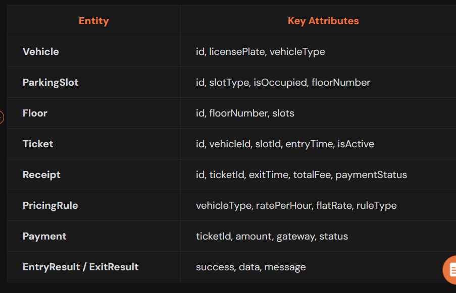
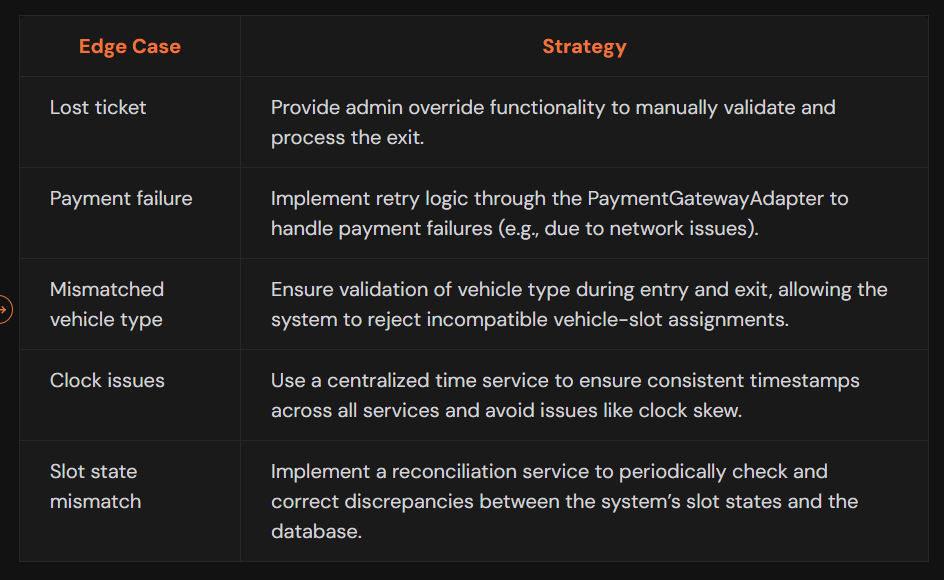

# Functional Requirements

Entry Flow
- Vehicle arrives at gate
- Assign slot based on vehicle type
- Generate ticket
- Mark slot as occupied
- Return entry response

Exit Flow
- Present ticket
- Calculate fee using pricing rules (flat vs hourly)
- Process payment
- Release slot
- Return exit response with receipt

Admin Flow
- Add/Edit/Delete floors and slots
- Define/update pricing rules on vehicle types (both flat and hourly rates)
- View parking lot status

Edge cases:
- Payment failure at exit
- Lost ticket
- System clock mismatch
- Slot marked occupied wrongly

# Step 2: Identify Core Entities

<Now code Entities  inside domain/entity package>

# Step 3: Discuss Interaction Flows

Entry Flow
- Vehicle arrives
- Slot allocated
- Ticket generated
- Slot marked as occupied

Exit Flow
- Ticket scanned
- Fee calculated
- Payment processed (with retries)
- Receipt generated
- Slot released
- Ticket deactivated

Admin Flow
- Add floor
- Add slot
- Update pricing

# Step 4: Defines Class Structures & Relationships

Layers of Architecture
We will design the architecture layers of the system in a structured way, ensuring separation of concerns and modularity. The system will be organized into the following layers:

Client Layer → Controller Layer → Service Layer → Repository Layer → Domain Layer

## Controllers
- Controller classes will correspond to title of your visual interactions
- EntryController.enterVehicle()
- ExitController.exitVehicle()
- AdminController.addFloor(), addSlot(), updatePricing()

<Now add code for Controller>.

## Services

TicketService
- Ticket generateTicket(Vehicle vehicle, ParkingSlot slot)
- Ticket getTicket(UUID ticketId)

SlotService
- ParkingSlot allocateSlot(VehicleType vehicleType)
- void releaseSlot(UUID slotId)

PricingService
- double calculateFee(Ticket ticket)

PaymentService 
- boolean processPayment(UUID ticketId, double amount)

ReceiptService 
- Receipt generateReceipt(Ticket ticket, double fee, boolean paymentSuccess)

AdminService 
- void addFloor(int floorNumber)
- void addSlot(int floorNumber, VehicleType slotType)
- void updatePricing(VehicleType vehicleType, double flatRate)
- void updateHourlyPricing(VehicleType vehicleType, double ratePerHour)

## Repositories 

Tie your repository with service classes 

The Repositories will abstract data access for the core entities like TicketRepository, SlotRepository, FloorRepository, PricingRuleRepository, PaymentRepository. Each repository will be responsible for:
Managing CRUD operations (Create, Read, Update, Delete) for Tickets, Slots, Floors, Pricing Rules, and Payments
Providing methods to query and persist data efficiently

TicketRepository
- void save(Ticket ticket)
- Ticket findById(UUID ticketId)
- List<Ticket> findActiveTickets()
- void deactivate(UUID ticketId)

SlotRepository
- void save(ParkingSlot slot)
- ParkingSlot findById(UUID slotId)
- ParkingSlot findAvailableSlot(VehicleType vehicleType)

FloorRepository 
- void save(Floor floor)
- Floor findByFloorNumber(int floorNumber)

PricingRuleRepository
- void save(PricingRule rule)
- PricingRule findByVehicleType(VehicleType vehicleType)

PaymentRepository 
- void save(Payment payment)
- Payment findByTicket(UUID ticketId)

## Interfaces

PaymentGatewayAdapter
- boolean pay(UUID ticketId, double amount)

Implementations
- RazorPayAdaptor
- StripeAdaptor
  
# Step 5: Implement Core Use Cases

The system will be designed around key use cases, with each use case mapped to corresponding service and repository methods.

Entry Use Case
enterVehicle() → SlotService.allocateSlot() → TicketService.generateTicket() → TicketRepository.save() → Return EntryResult

Exit Use Case:
exitVehicle() → TicketService.getTicket() -> PricingService.calculateFee() -> PaymentService.processPayment() -> PaymentGatewayAdapter.pay() -> SlotService.releaseSlot() -> ReceiptService.generateReceipt() → Return ExitResult

Admin Use Cases:
addFloor() -> AdminService -> FloorRepository.save()
addSlot() -> SlotRepository.save()
updatePricing() -> PricingRuleRepository.save()

Interview Tip: During interviews, make sure to map each use case directly to the services and repositories it interacts with. This shows clarity in your design and ensures the workflow is easily understandable.

# Step 6: Explain Design Patterns and OOP principles applied

Design Pattern Used:
- Adapter Pattern: Abstraction of payment gateways
- Repository Pattern: Isolation of database operations
- Service Layer Pattern: Centralization of business logic

OOP Principles Applied:
- SRP (Single Responsibility Principle): Each class has one clear responsibility
- ISP (Interface Segregation Principle): Role-specific interfaces (e.g., for payment)
- DIP (Dependency Inversion Principle): Services depend on interfaces, not concrete implementations
- Open/Closed Principle: The system is open for extension but closed for modification, easy to extend with new vehicle types, pricing strategies, payment types
- Encapsulation: Domain entities encapsulate both data and behavior

# Step 7: Edge case (if you have time)

NOTE: just mention the handling, don't go and actually code for above unless asked 